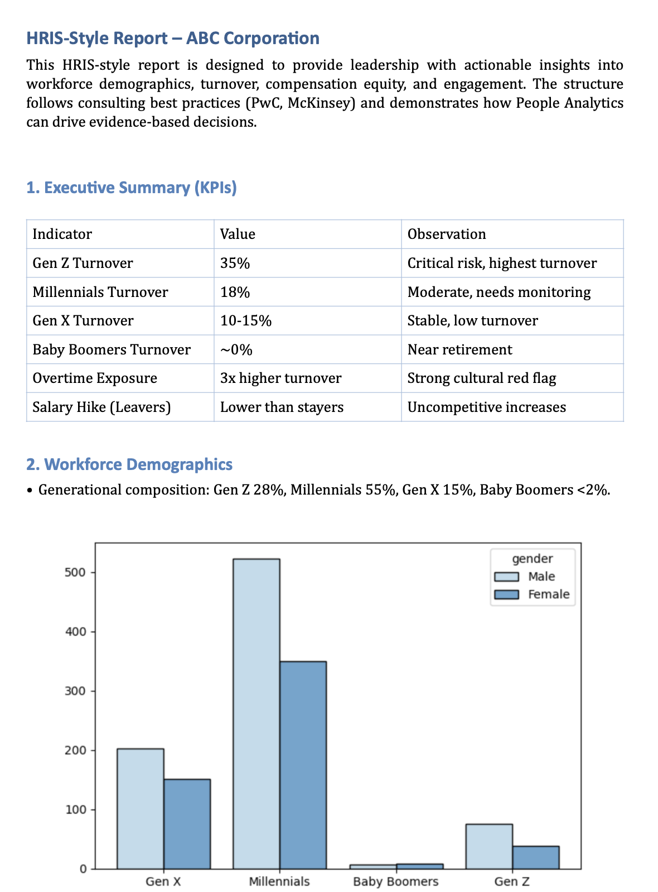

# Talent Optimization for Corporation – HR Data Analytics

## Project Overview
This project applies **People Analytics** and **HRIS-style reporting** to a corporate HR dataset (BluePeak Technologies), with the goal of identifying workforce trends, risks, and actionable insights for leadership. The analysis covers demographics, turnover, compensation & equity, diversity & inclusion, engagement, and HR’s internal role.  

The final output is a **consulting-style HRIS Report** (PDF) that consolidates findings into KPIs, visual dashboards, and executive recommendations.  

---

## Objectives
- Explore HR data (raw and cleaned) using Python and SQL.  
- Apply **ETL processes**: extraction, transformation, cleaning, and loading into structured formats.  
- Conduct **EDA (Exploratory Data Analysis)** with pandas, seaborn, and matplotlib.  
- Build an **HRIS-style reporting structure**, aligned with consulting frameworks.  
- Generate **strategic insights** on demographics, turnover, compensation equity, engagement, and diversity.  

---

## Repository Structure
```
TALENT-OPTIMIZATION-FOR-CORPORATION-HR-DATA-ANALYTICS
│
├── Data-Analytics-and-Vizualization
│   ├── context.ipynb
│   ├── hr_data_cleaned.csv
│   ├── start_stop_continued.ipynb
│
├── EDA
│   ├── cleaning_and_export_CSV.ipynb
│   ├── columnas_exploracion_visual.ipynb
│   ├── exploracion_hr_cleaned.ipynb
│   ├── exploration_hr_raw.ipynb
│   ├── hr_raw_data.csv
│   └── info_completo.txt
│
├── SQL
│   ├── EER_DIAGRAM.mwb
│   ├── Forward_engineer.sql
├    └── mysql.connector.ipynb
│
├── HRIS_Report_demo.pdf
├── HRIS_Report_Preview.png
└── README.md

```

---

## Methodology
1. **Data Cleaning & Transformation**  
   - Removal of duplicates and missing values.  
   - Standardization of education, job role, and demographic fields.  

2. **Exploratory Data Analysis (EDA)**  
   - Demographics: age, gender, education, generations.  
   - Turnover analysis by generation, overtime, job role.  
   - Compensation analysis: salary vs. education, salary hikes for leavers vs. stayers.  
   - Diversity & Inclusion: gender balance by role and generation.  
   - Engagement & satisfaction: by department and role.  

3. **SQL & Data Modeling**  
   - Schema design with forward engineering.  
   - SQL queries to replicate HRIS dashboards and KPIs.  

4. **Reporting & Recommendations**  
   - Start / Stop / Continue tracker (strategic actions).  
   - Quick Wins & Recommendations (short-term tactical actions).  
   - Focus on **Gen Z retention**, **pay equity**, and **HR’s strategic role**.  

---

## Frameworks & References
The structure of this HRIS Report is inspired by **market-recognized frameworks and consulting best practices**:  

- McKinsey & Company (2023). *How to be great at people analytics*.  
  Available at: [McKinsey](https://www.mckinsey.com/capabilities/people-and-organizational-performance/our-insights/how-to-be-great-at-people-analytics)  

- PwC España (2023). *Guía práctica de reporting integrado*.  
  Available at: [PwC](https://www.pwc.es/es/sostenibilidad/assets/guia-practica-reporting-integrado-pwc.pdf)  

---

## Deliverables
- **Clean HR datasets** (CSV).  
- **Exploration notebooks** with EDA and visualizations.  
- **SQL scripts** for HRIS schema and reporting queries.  
- **HRIS Report (PDF)** with dashboards, insights, and executive recommendations.  


### Example — Data Cleaning in Python

```python
import numpy as np
import pandas as pd

df = pd.read_csv("hr_raw_data.csv")

# Standardize categorical columns
cat_cols = ['BusinessTravel', 'Department', 'EducationField', 'Gender',
            'JobRole', 'MaritalStatus', 'OverTime', 'RemoteWork']
for c in cat_cols:
    df[c] = df[c].astype(str).str.strip().str.title()

# Cast numeric columns
num_cols = ['DailyRate', 'MonthlyIncome', 'MonthlyRate', 'PercentSalaryHike',
            'DistanceFromHome', 'Age']
df[num_cols] = df[num_cols].apply(pd.to_numeric, errors='coerce')

# Correct invalid distances
df.loc[df['DistanceFromHome'] < 0, 'DistanceFromHome'] = np.nan
```

### Example — Feature Engineering

```python
# Compute age from year of birth
df['Age'] = 2025 - df['DateBirth']

# Derive Generation
def classify_generation(y: int) -> str:
    if y >= 1997: return 'Gen Z'
    elif y >= 1981: return 'Millennials'
    elif y >= 1965: return 'Gen X'
    elif y >= 1946: return 'Baby Boomers'
    else: return 'Silent Generation'

df['Generation'] = df['DateBirth'].apply(classify_generation)

# Export final dataset
df.to_csv("hr_data_cleaned.csv", index=False)
```

---

### Schema Design

- `employee` (core identifiers, attrition flag)  
- `employee_demographics` (gender, age, marital status, generation, etc.)  
- `employee_professional` (role, department, tenure, travel, remote work, etc.)  
- `employee_financial` (salary, rates, stock options, hikes)  
- `employee_satisfaction` (satisfaction scores, performance, work-life balance)  

### Example — Forward Engineering (MySQL Workbench)

```sql
CREATE SCHEMA IF NOT EXISTS `abc_corp` DEFAULT CHARACTER SET utf8 ;
USE `abc_corp` ;

CREATE TABLE employee (
  employeenumber INT PRIMARY KEY,
  attrition VARCHAR(10) NOT NULL
);

CREATE TABLE employee_demographics (
  employeenumber INT PRIMARY KEY,
  age INT,
  gender VARCHAR(20),
  marital_status VARCHAR(20),
  date_birth DATE,
  generation VARCHAR(30),
  education VARCHAR(50),
  educationfield VARCHAR(50),
  distance_from_home INT,
  FOREIGN KEY (employeenumber) REFERENCES employee(employeenumber)
);

---

## Analytics & Visualizations

### Active Employees by Generation and Gender

```python
import seaborn as sns
import matplotlib.pyplot as plt

active = df[df['Attrition'] == 'No']

sns.histplot(data=active, x='Generation', hue='Gender',
             multiple='dodge', shrink=0.8, palette='rocket')
plt.title('Active Employees by Generation and Gender')
plt.show()
```

### Key Insight
Gen Z is a smaller share today but shows the highest turnover—creating retention risk as they become the dominant segment this decade. This also signals business opportunities to strengthen organizational culture and adapt to evolving employee needs.


---

## Example SQL Analytics Queries

**Income Distribution by Job Level**

```sql
SELECT
  p.job_level,
  ROUND(AVG(f.monthly_income),2) AS avg_income,
  ROUND(MAX(f.monthly_income),2) AS max_income
FROM employee_professional p
JOIN employee_financial f USING (employeenumber)
GROUP BY p.job_level;
```
---

## HRIS Report Preview  
Below is a preview of the **HRIS Report**, presented in a consulting format:  

  
*Refer to **HRIS_Report_demo.pdf** to access a sample consulting-style HRIS report, including KPIs, workforce demographics, turnover analysis, and actionable recommendations.*  

---

## How to Reproduce

1. Clone the repo and create a virtual environment.  
2. Install dependencies (`pandas`, `numpy`, `matplotlib`, `seaborn`, `mysql-connector-python`).  
3. Run `cleaning_and_export_CSV.ipynb` to generate `hr_data_cleaned.csv`.  
4. Run `forward_engineer.sql` in MySQL Workbench to create the schema.  
5. Execute the ETL script to load the data.  
6. Run analytics notebooks for visuals and KPIs.  

---

## Credits

This project was developed in two phases:  
1. **Collaborative phase:** Exploratory Data Analysis (EDA) and Data Visualization carried out jointly.  
2. **Individual extension (Ana Nobre Santos):** New insights on salary equity, database design from scratch, HRIS reporting, and ETL pipeline development.  

- **Ana Nobre Santos** – Database Design, SQL, ETL and HRIS Reporting  
  - Designed and implemented the HR database schema from scratch (forward engineering + SQL queries).  
  - Extended exploratory analysis with advanced **EDA and Data Visualization by job roles**.  
  - Developed the **HRIS-style Report (PDF)** consolidating insights, dashboards, and executive recommendations.  
  - Applied new ETL techniques individually to integrate analytics with HR strategy.  

- **Carmen** – Data Transformation & Cleaning  
  Prepared the dataset through cleaning, normalization, and transformation processes to ensure data quality.  

- **Gabriela** – Data Exploration & Visualization  
  Conducted exploratory data analysis (EDA) and developed visualizations to identify workforce patterns and trends.  

- **Irene** – Communication Strategy & Exploratory Analysis  
  Focused on drafting key narratives, and aligning findings with business communication.  
